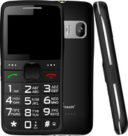
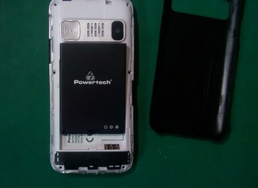
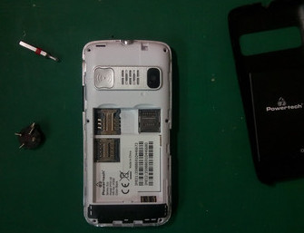
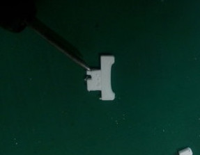
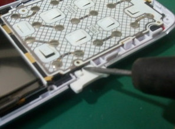
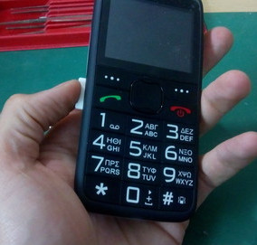

# Power button mod - PowerTech Sentry Eco
> A physical accessibility modification to the PowerTech Sentry Eco feature phone aimed at the elderly.

  

## Summary

The PowerTech Sentry Eco is a fairly popular choice of a feature phone for the elderly in my country. It is not without its problems but the implementation of a couple of features and decent localization puts it a step above other OEM solutions. Coupled with an affordable price it is used pretty widely.

One interesting feature is the use of a locking slide button. It gets rid of the combination of keys and helps aliviate confusion. My issue however was that the slider was challenging to operate for someone with mobility limitations. It was recessed and needed a fair amount of dexterity to operate. The power and flashlight sliders (pictured right) are identical

Considering the fact that the SOS button _does not_ function if the phone is locked and accidental presses of buttons (or the SOS button itself) is an issue when the phone is in a pocket I thought it neccessary to design an easier to operate slider button.

## Dissasembly and Installation

The dissasebmly process is simple, nothing really to worry about. Only places of concern are not scratching up the plastic when prying the case open, not pulling too much on the screen (and tearing up the ribbon cable) and keeping everthing in place when closing everything up.

##### BOM
* The button 

##### Tools
*  PH00 screwdriver to take the phone apart
*  A plastic spudger or guitar pick to pry open the plastic parts
*  A small file to bring the button down to tolerances if things are too tight 

### Step 0

Print or have the button printed. If you are not familiar with 3d printing just providing the stl file to a 3d printing service should  suffice (the part is fairly small so you might want to consider having something else printed along with it to make it worth it. A lithograph of a photo might be a nice present)

No supports are required, print with 3 walls and at 100% infill (mostly to avoid rapid movement along the small part). 

You may need to file down some spots depenting on how calibrated your printer is and the manufacturing tolerances of the phone (your device might be measurably deifferent than my reference one). If you need to scale up or want to tinker with the button you can download the stp (or f3d if you are on Fusion360).

I would print a couple at a time since it basically adds no time to the print.

### Step 1 

Take off the back and battery. You can leave SIM cards and microSD cards installed if you want. 
<>
### Step 2

Unscrew the 6 back screws with the PH00 driver. Use a magnet or tray to keep track of them. They are all the same length so no need to worry about mixing them up. 

### Step 3

Pry off the front bezel. Use a guitar pick, sputzer or your nail to pry of a corner. Then keep that corner up going around the phone and getting the rest of the clips off. Don't use a flathead screwdriver or a metal tool if you don't want to risk scratching the soft plastic around the phone.

### Step 4

Get the front bezel and button assembly off the phone. Be carefull not to scratch or nick the screen. Be aware that it might want to pull off along with the bezel, dont tear the ribbon cable underneath. Take off the buttons and keep them in the tray. 

### Step 5

Try the fit of the button. If something snags file it. If not try to assemble enough to test the fit. I would at least try to file the channel at the top of the button since I found it to interfere just a bit.

### Step 6

Final assembly. Keep things in place as you snap the clips together and test that everything moves freely as you screw everything in. 

## CAUTION

Check thoroughly that the lock unlock function works and doesn't snag. Check applying pressure from various angles as you unlick the phone. Remember that the person using this device might need to unlock it while in distress. If you don't feel it works well enough either try again or raise an issue to inform and have me or others work on it.
